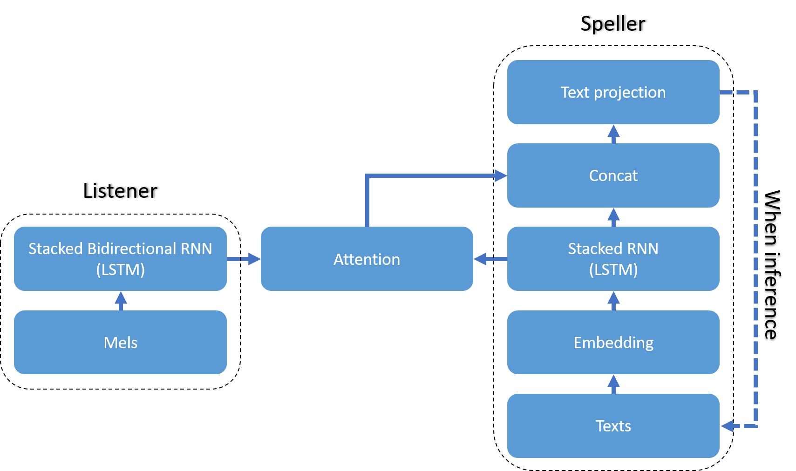

# LAS model
This code is a TF 2.0 implementation of paper `'Listen, Attend and Spell'`. The algorithm is based on the following papers:

```
Chan, W., Jaitly, N., Le, Q., & Vinyals, O. (2016, March). Listen, attend and spell: A neural network for large vocabulary conversational speech recognition. In 2016 IEEE International Conference on Acoustics, Speech and Signal Processing (ICASSP) (pp. 4960-4964). IEEE.
```

# Structure


# Used dataset
I used speech files with a length between 0.5s and 10.0s in the following datasets. Length can be modified in 'Hyper_Parameters.json'

```
VCTK: https://datashare.is.ed.ac.uk/handle/10283/2651
LibriSpeech: http://www.robots.ox.ac.uk/~vgg/data/voxceleb/    
TIMIT: http://academictorrents.com/details/34e2b78745138186976cbc27939b1b34d18bd5b3
```

# Instruction

## Pattern generate

```
python Pattern_Generator.py [options]
```

### Options
* `-vctk <path>`
    * Set the path of VCTK.
    * VCTK dataset based patterns are generated.
* `-ls <path>`
    * Set the path of LibriSpeech.
    * LibriSpeech dataset based patterns are generated.
* `-timit <path>`
    * Set the path of TIMIT.
    * TIMIT dataset based patterns are generated.
* `-all`
    * All save option.
    * Generator ignore the 'Min_Wav_Length' and 'Max_Wav_Length' parameters in train of hyper parameter.
    * If this option is not set, only patterns matching 'Min_Wav_Length' and 'Max_Wav_Length' will be generated.

## Train

```
python Model.py
```

The model stops learning only when you force stop (e.g. Ctrl + C).


## Inference

1. Run 'ipython' in the model's directory.
2. Run following command:

    ```
    from Model import DeepSpeech2
    new_Model = DeepSpeech2(is_Training= False)
    new_Model.Restore()
    ```

3. Set the wav path list like the following example:

    ```
    path_List = [
        './Inference_Test/LJ050-0277.wav',
        './Inference_Test/17-363-0039.wav'
        ]
    ```

4. Run following command:

    ```
    new_Model.Inference(wav_Path_List= path_List, label= 'New_Inference')
    ```

5. Check the 'Plot' directory of inference directory which is set at 'Inference_Path' of hyper parameter.

# Result

* This result is with uploaded hyper parameters.


# Trained checkpoint file

# Future works

* Find out why the attention formation failed
    * Problem candidate 1: Insufficiency of model training epochs or patterns
    * Problem candidate 2: Bug in code
    * Problem candidate 3: TF 2.0 attention layers(tf.keras.layers.Attention | tf.keras.layers.AdditiveAttention) problem